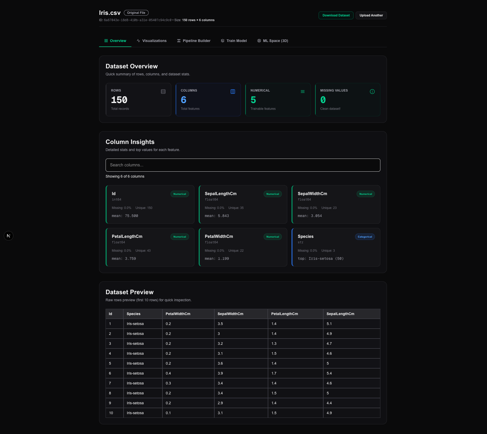
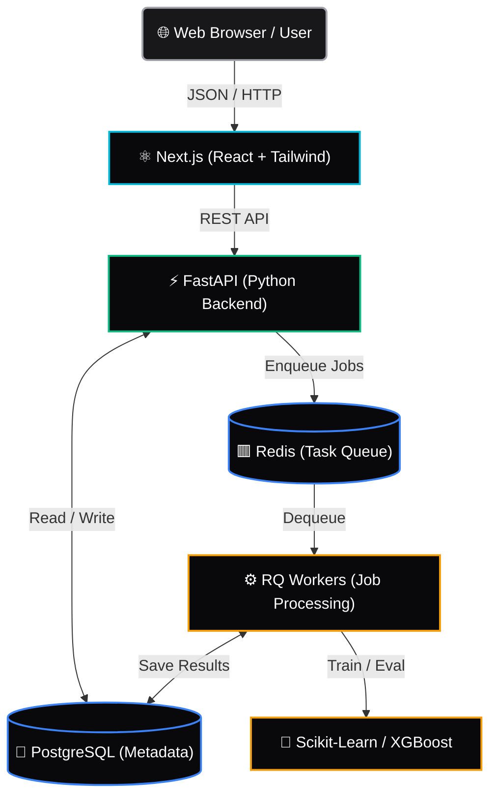

# Lattis — Interactive Machine Learning Studio

## 🌐 Live Demo
**[https://lattis.vercel.app](https://lattis.vercel.app)** *(Replace with your actual deployed app link)*

🎥 **Demo Video:** [https://youtu.be/...](https://youtu.be/...) *(Replace with your actual YouTube video link)*

⭐ **Star the repository if you found it useful!**

---

> Existing AutoML tools are powerful but often hide what happens internally. Lattis was built to make machine learning interactive and visual, allowing users to understand preprocessing, model training, and predictions through an immersive 3D environment.


*(Note: To add your demo GIF, simply record a 5-8 second screen recording of the app, convert it to a `.gif`, name it `demo.gif`, and place it inside the `docs/` folder!)*

## 🤔 Why Lattis?
- ✓ **Interactive ML:** Build pipelines and train models visually without writing code.
- ✓ **Beginner friendly:** Understand ML algorithms by literally *seeing* their decision boundaries.
- ✓ **Runs locally with Docker:** One command spins up the entire distributed stack.
- ✓ **Modern 3D visualization:** WebGL-powered 3D space with cinematic particle effects.
- ✓ **Open Source:** Fully transparent and customizable.

---

## 🚀 Features

### 1. Dataset Profiling & Cleaning


- **Upload & Parse:** Drag and drop `.csv` files.
- **Statistical Analysis:** Automatic calculation of mean, median, standard deviation, and missing values.
- **Categorical Insights:** Fast value-count binning and distributions.

### 2. Pipeline Builder (No-Code Preprocessing)
- Build robust scikit-learn preprocessing pipelines visually.
- Support for One-Hot Encoding, Label Encoding, Standard Scaling, MinMax Scaling, and custom Missing Value Imputations (Mean, Median, Mode, Constant).

### 3. Model Training Engine
- Train models asynchronously.
- **Algorithms Supported:**
  - Classification: Logistic Regression, Random Forest, XGBoost, LightGBM, Decision Trees, SVM, KNN
  - Regression: Linear Regression, Ridge, Random Forest, XGBoost, LightGBM
  - Clustering: K-Means (with auto-PCA projection for visualization)
- **Live Metrics:** Accuracy, F1-Score, RMSE, R², and live Confusion Matrices.

### 4. The ML Universe (WebGL / Three.js)
Explore your dataset and model predictions in a fully immersive 3D space.
- **Data Points:** Millions of rows rendered using WebGL instanced particle systems.
- **Decision Boundaries:** Interpolated 3D surfaces showing regression planes or classification boundaries.
- **Clusters & PCA:** Soft volumetric cluster clouds and dynamic PCA projections.
- **Feature Pillars:** Real-time feature importance visualizations hovering above the dataset.
- **Live Predictions:** Send arbitrary input vectors through the trained model and watch the "Probe" fly through the 3D space to the nearest neighbors in real-time.
- **Cinematic Settings:** Control scene presets (Cinematic, Bright, High Contrast) and adjust particle sizes dynamically.

## 🏗️ Architecture

Lattis is built as a distributed, containerized application designed for scale and performance.



## 🛠️ Technology Stack

- **Frontend:** Next.js, React, Tailwind CSS, Three.js, React Three Fiber.
- **Backend API:** FastAPI, Pydantic, SQLAlchemy.
- **Machine Learning:** Scikit-learn, XGBoost, LightGBM, Pandas, Numpy.
- **Infrastructure:** Docker, Docker Compose, PostgreSQL, Redis, RQ (Redis Queue).

## ⚡ Local Development (One-Command Start)

Lattis comes with a fully configured `docker-compose.yml` file that orchestrates the **entire** stack locally (Next.js Frontend, FastAPI Backend, PostgreSQL, Redis, and RQ Workers) with a single command. This works seamlessly across Windows, Mac, and Linux.

### 1. Prerequisites
- [Docker Desktop](https://www.docker.com/products/docker-desktop/) installed and running.

### 2. Start the Entire Application
```bash
docker-compose up --build
```

### 3. Access Lattis
Once Docker finishes building and the containers are running:
- **Frontend Dashboard:** Go to [http://localhost:3000](http://localhost:3000)
- **FastAPI Backend / Swagger UI:** Go to [http://localhost:8000/docs](http://localhost:8000/docs)

*Note: The first time you run this command, Docker will download the necessary base images and install the machine learning dependencies, which may take a few minutes. Subsequent startups will be instant.*

## 📖 API Contracts

Detailed API documentation is located in [`docs/contracts.md`](docs/contracts.md). This covers all endpoints, expected request bodies, and database schemas.

## 🗺️ Roadmap

- [ ] Authentication
- [ ] Saved Workspaces
- [ ] SHAP Explainability
- [ ] Time-series forecasting
- [ ] Neural Network support
- [ ] LLM-powered dataset insights
- [ ] Collaborative projects

## 🚢 Recommended Production Deployment

- **Frontend:** Vercel (zero-config, edge caching)
- **Backend (FastAPI, Redis, Postgres, RQ Worker):** Railway or Render (native Dockerfile support, easy internal networking)

## 🤝 Author

**Aabhas Sharma**  
University of Delhi  
[LinkedIn](https://www.linkedin.com/in/) *(Update with your actual link)*  
[Portfolio](#) *(Update with your actual link)*

## 📄 License
MIT License
