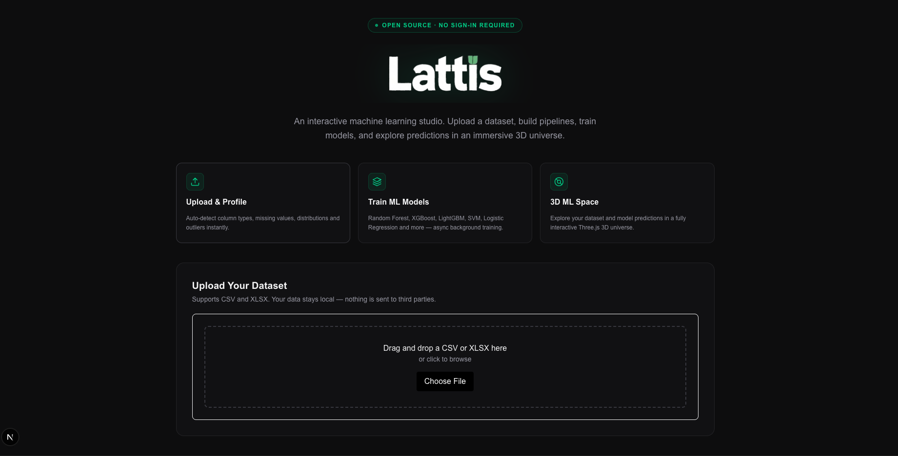

# Lattis — Interactive Machine Learning Studio

**Lattis** is an interactive machine learning studio for experimenting with data preprocessing, model training, evaluation, and immersive 3D visualization. It combines an end-to-end ML workflow with a custom built Three.js-powered ML Universe, enabling users to explore datasets, compare models, and understand machine learning visually.



## 🚀 Features

### 1. Dataset Profiling & Cleaning


- **Upload & Parse:** Drag and drop `.csv` files.
- **Statistical Analysis:** Automatic calculation of mean, median, standard deviation, and missing values.
- **Categorical Insights:** Fast value-count binning and distributions.

### 2. Pipeline Builder (No-Code Preprocessing)
- Build robust scikit-learn preprocessing pipelines visually.
- Support for One-Hot Encoding, Label Encoding, Standard Scaling, MinMax Scaling, and custom Missing Value Imputations (Mean, Median, Mode, Constant).

### 3. Model Training Engine
- Train models asynchronously.
- **Algorithms Supported:**
  - Classification: Logistic Regression, Random Forest, XGBoost, LightGBM, Decision Trees, SVM, KNN
  - Regression: Linear Regression, Ridge, Random Forest, XGBoost, LightGBM
  - Clustering: K-Means (with auto-PCA projection for visualization)
- **Live Metrics:** Accuracy, F1-Score, RMSE, R², and live Confusion Matrices.

### 4. The ML Universe (WebGL / Three.js)
Explore your dataset and model predictions in a fully immersive 3D space.
- **Data Points:** Millions of rows rendered using WebGL instanced particle systems.
- **Decision Boundaries:** Interpolated 3D surfaces showing regression planes or classification boundaries.
- **Clusters & PCA:** Soft volumetric cluster clouds and dynamic PCA projections.
- **Feature Pillars:** Real-time feature importance visualizations hovering above the dataset.
- **Live Predictions:** Send arbitrary input vectors through the trained model and watch the "Probe" fly through the 3D space to the nearest neighbors in real-time.
- **Cinematic Settings:** Control scene presets (Cinematic, Bright, High Contrast) and adjust particle sizes dynamically.

## 🏗️ Architecture

Lattis is built as a distributed, containerized application designed for scale and performance.

```text
                  ┌────────────────────────┐
                  │                        │
                  │   Lattis Web Client    │
                  │   (Next.js + React)    │
                  │                        │
                  └───────────┬────────────┘
                              │
                    REST API (JSON / HTTP)
                              │
                  ┌───────────▼────────────┐
                  │                        │
                  │   FastAPI ML Engine    │
                  │       (Python)         │
                  │                        │
                  └─────┬────────────┬─────┘
                        │            │
            Jobs        │            │   Read/Write
          (RQ Enqueue)  │            │  (SQLAlchemy)
                        │            │
            ┌───────────▼──┐      ┌──▼───────────┐
            │              │      │              │
            │    Redis     │      │  PostgreSQL  │
            │ (Task Queue) │      │  (Metadata)  │
            │              │      │              │
            └──────┬───────┘      └──────────────┘
                   │
           Dequeue │
                   │
            ┌──────▼───────┐
            │              │
            │  RQ Workers  │
            │(Model Train) │
            │              │
            └──────────────┘
```

## 🛠️ Technology Stack

- **Frontend:** Next.js, React, Tailwind CSS, Three.js, React Three Fiber.
- **Backend API:** FastAPI, Pydantic, SQLAlchemy.
- **Machine Learning:** Scikit-learn, XGBoost, LightGBM, Pandas, Numpy.
- **Infrastructure:** Docker, Docker Compose, PostgreSQL, Redis, RQ (Redis Queue).

## ⚡ Local Development

Lattis comes with a `docker-compose.yml` file that orchestrates the entire stack (PostgreSQL, Redis, FastAPI backend, and Background Workers) locally with one command.

### 1. Prerequisites
- Docker and Docker Compose
- Node.js 18+

### 2. Start the Backend Stack (API, DB, Redis)
```bash
docker-compose up --build
```
This will start:
- FastAPI server on `http://localhost:8000`
- PostgreSQL on port `5432`
- Redis on port `6379`
- RQ Worker listening to the default queue

### 3. Start the Frontend
In a new terminal window:
```bash
cd apps/web
npm install
npm run dev
```
The web application will be available at `http://localhost:3000`.

## 🚢 Recommended Production Deployment

- **Frontend:** Vercel (zero-config, edge caching)
- **Backend (FastAPI, Redis, Postgres, RQ Worker):** Railway or Render (native Dockerfile support, easy internal networking)

## 📄 License
MIT License
